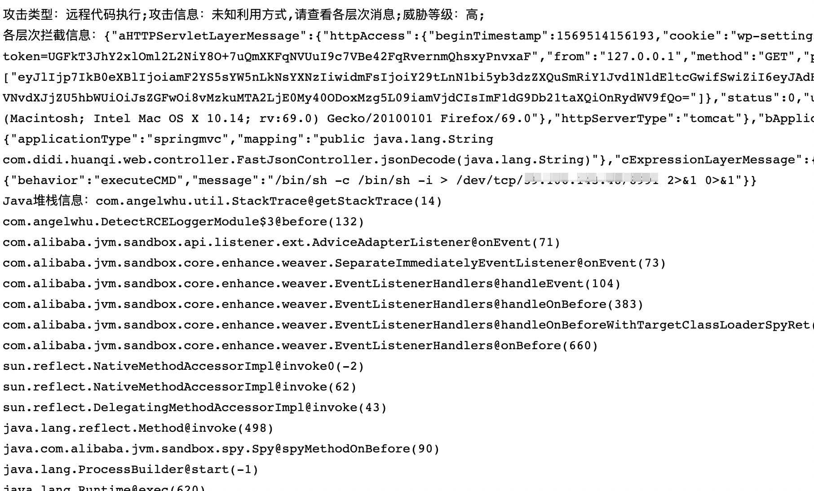

# jvm-rasp
基于JVM-Sandbox实现RASP安全监控防护。防护基本的RCE攻击和SQL注入。

## 0x00 安装部署
先下载阿里的工具：[JVM-Sandbox](https://github.com/alibaba/jvm-sandbox/releases)。下载二进制包，解压。  

使用Maven构建该工程:   
`mvn clean package`   
将target下的`jvm-rasp-1.0-SNAPSHOT-jar-with-dependencies.jar`文件放在JVM-Sandbox的`module`目录下～ 

## 0x01 运行  

参考JVM-Sandbox的wiki，这里用热插拔的形式。   

- 找到运行Java Web程序的进程号（Tomcat、Jetty、SpringBoot都可以）   
- 使用sandox的bin目录下sandbox.sh脚本，即可动态启动检测程序。  

`./sandbox.sh -p ${pid}`   
`./sandbox.sh -p ${pid} -d "detect-rce-logger/rcedetect"`   
`./sandbox.sh -p ${pid} -d "detect-SQL-injection/sql_injection_detect`   

## 0x02 整合jvm-sandbox  
- 我把jvm-sandbox(版本1.0.16)下载下来，放在了sandbox目录下。  
- log日志在`~/logs/sandbox/`。 
- 运行前在`AlarmSendMailThread`类配置邮箱pop3密码和管理员邮箱。
- 参考我写`run.sh`脚本运行。  
- 使用springboot框架，测试检测fastjson漏洞成功。   

示例视频请看: `./images/demo.mp4`   

邮件收到的报警信息:  
  

## 0x03 问题  
- 新版本有问题,不支持JDK的增强: [https://github.com/alibaba/jvm-sandbox/issues/168](https://github.com/alibaba/jvm-sandbox/issues/168)。使用1.0.16版本。

## 0x04 功能和原理 

`DetectSQLInjectionModule` 检测SQL注入，用了百度的OpenRASP算法。   
`DetectRCELoggerModule` 通过Hook底层执行命令的函数，回溯判断攻击类型，并迅速定位整个调用栈。

## 0x05 参考文章  
[RASP技术实现](https://www.angelwhu.com/paper/2019/05/12/rasp-technology-implementation/#more)  
[基于RASP技术的Java Web框架漏洞通用检测与定位方案](https://kns.cnki.net/kcms/detail/detail.aspx?dbcode=CJFD&dbname=CJFDLAST2020&filename=WHDY202003011)